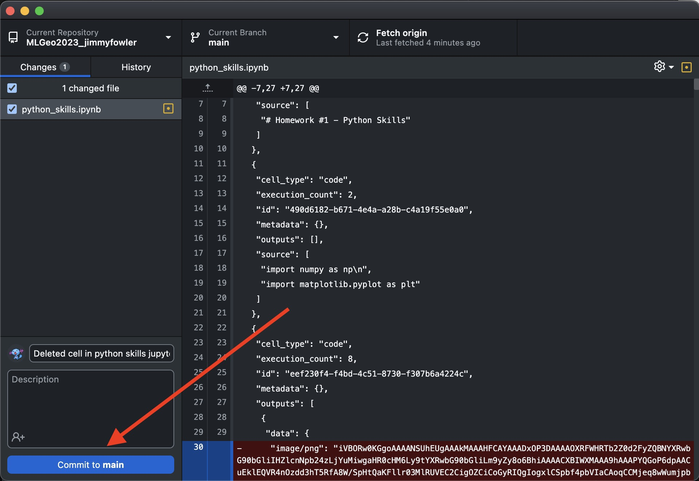
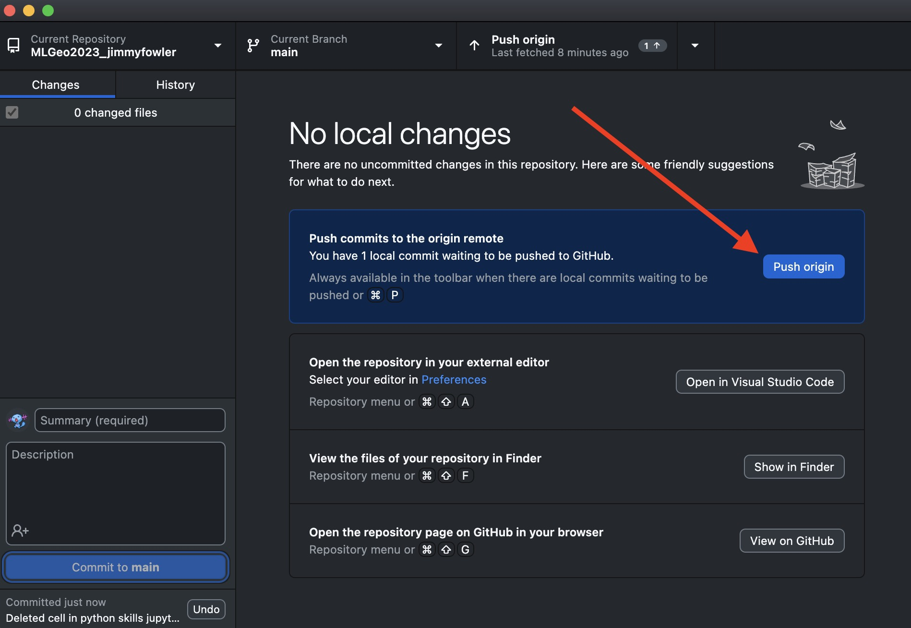

# Jimmy Fowler's MLGeo Repo!

[Class GitHub](https://github.com/UW-ESS-DS/MLGeo-2023)

### Favorite Earth Science Topics
- Hydrology
- Seismology
- Oceanography
- I'm interested in applying these fields of research to other planets as well!

### Clone this repository
(in your terminal)

`git clone https://github.com/UW-ESS-DS/MLGeo2023_jimmyfowler.git`

#### Pushing changes with git

If you have made changes to your local repository, you can push those changes to the main repository with terminal commands.

if you are in the directory for your repo, type
`git commit .` _note the dot at the end_
`git commit -m "COMMIT MESSAGE GOES HERE"`
`git push`

If your terminal is securely connected to the main repository via SSH, or you configure a personal access token, you should be good to go! If you are having issues with this connection (as I am currently), you can use the GitHub Desktop application insead:

Connect your VS Code to your GitHub Desktop, so that saved changes will be automatically added and prepared to commit as shown:

After commiting the changes, you can simply click the push button and let the app do its magic.

Voila.

### Licensing
I chose to use the MIT License for this repository, which you can find on the same level as this README file.
