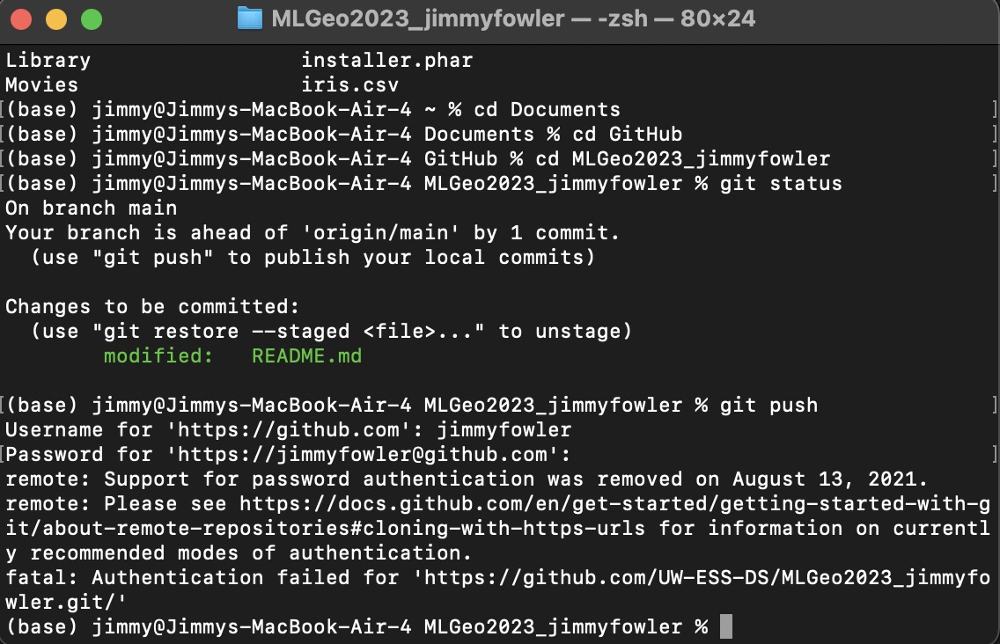

# Jimmy Fowler's MLGeo Repo!

[Class GitHub](https://github.com/UW-ESS-DS/MLGeo-2023)

### Favorite Earth Science Topics
- Hydrology
- Seismology
- Oceanography
- I'm interested in applying these fields of research to other planets as well!

### Clone this repository
(in your terminal)

`git clone https://github.com/UW-ESS-DS/MLGeo2023_jimmyfowler.git`

#### Pushing changes with git

### Licensing
I chose to use the MIT License for this repository, which you can find on the same level as this README file.
